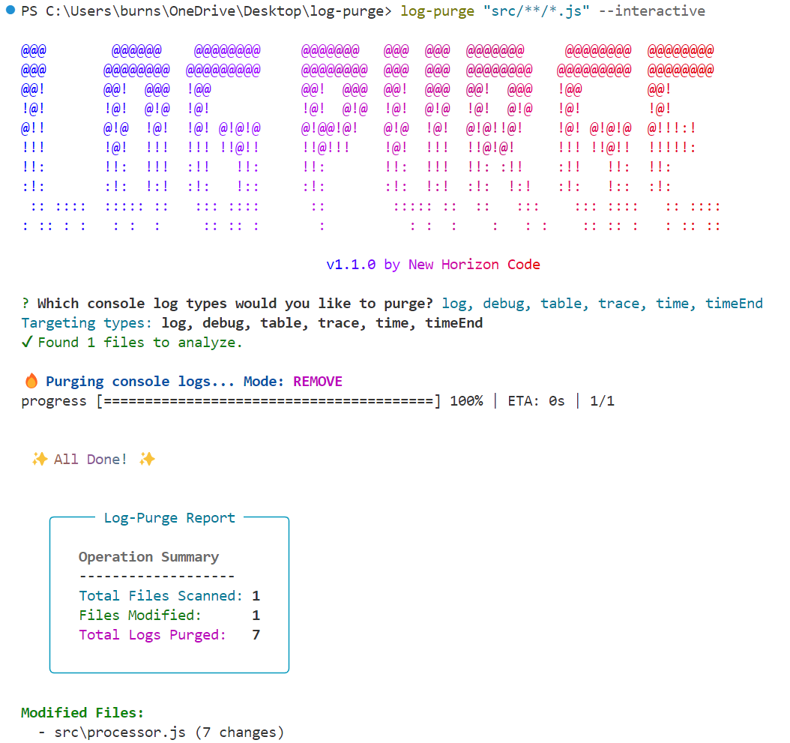

# 🔥 Log-Purge 🔥

A breathtakingly beautiful and powerful CLI from [New Horizon Code](https://newhorizoncode.io) to purge console statements from your codebase. Removes `console.log`, `console.error`, `console.warn`, `console.info`, `console.debug`, `console.assert`, `console.dir`, `console.table`, and `window.console.*` calls. Perfect for cleaning up debug statements before shipping to production, ensuring code quality and security.




---

## ✨ Features

* **Stunning CLI:** A visually appealing and informative interface that makes a mundane task enjoyable.
* **Multiple Modes:**
    * `remove`: Deletes console statements and cleans up empty lines.
    * `comment`: Comments out console statements with `//` prefix for easy toggling.
    * `replace`: Replaces console statements with a structured logger like `logger.info(`.
* **Safety First:**
    * **`--dry-run`** mode to see what will change without modifying any files.
    * Interactive confirmation prompt to prevent accidental changes.
* **Highly Configurable:** Use CLI flags or a `log-purge.config.js` file for complex setups.
* **Blazing Fast:** Uses parallel processing to scan and modify files at maximum speed.
* **Glob Support:** Use powerful glob patterns to target specific files and directories.
* **Comprehensive Detection:** Handles multiline console statements and various formats.
* **Markdown Reports:** Generate a summary report of the operation for your records.

### Supported Console Methods

Log-Purge detects and processes all these console methods:
- `console.log()` - Standard logging
- `console.error()` - Error messages  
- `console.warn()` - Warning messages
- `console.info()` - Information messages
- `console.debug()` - Debug messages
- `console.assert()` - Assertion logging
- `console.dir()` - Object inspection
- `console.table()` - Tabular data display
- `window.console.*` - Browser window-scoped console calls

The tool also handles multiline console statements and various formatting styles.

## 🗂️ Batch Folder Processing

Log-Purge excels at processing entire folder structures with intelligent batch processing:

### Folder Path Input
Instead of glob patterns, you can provide folder paths directly:
```bash
log-purge ./src                    # Process all default extensions in src/
log-purge ./components --extensions "js,ts,vue"  # Custom extensions
```

### Enhanced Statistics
Use `--batch-folders` to get detailed per-folder statistics:
```bash
log-purge "**/*.js" --batch-folders
```

This shows:
- Files processed per folder
- Console statements found/removed per folder
- Clean folders (no console statements)
- Folder-level performance metrics

### Intelligent File Discovery
- **Auto-detection**: Automatically detects if input is a folder vs glob pattern
- **Extension filtering**: Configurable file extensions for folder processing
- **Recursive scanning**: Processes all subfolders automatically
- **Ignore patterns**: Supports `.gitignore`-style ignore patterns

## 📦 Installation

Install globally using npm to use `log-purge` in any project:

```bash
npm install -g log-purge
```

## 🚀 Usage

The basic syntax is: `log-purge <pattern> [options]`

### Basic Examples

**1. Remove all console statements from all JavaScript files in the `src` directory:**

```bash
log-purge "src/**/*.js" --mode remove
```

**2. Comment out all console logs in TypeScript files, skipping confirmation:**

```bash
log-purge "app/**/*.ts" --mode comment --yes
```

**3. Preview the removal of console logs in all `.js` and `.ts` files (Dry Run):**

```bash
log-purge "**/*.{js,ts}" --ignore "node_modules/**" --dry-run
```

**4. Replace `console.log(` with `pino.info(` in your Vue components:**

```bash
log-purge "src/components/**/*.vue" --mode replace --replaceWith "pino.info("
```

**5. Process an entire folder and all subfolders:**
```bash
log-purge ./src --extensions "js,ts,jsx,tsx"
# Automatically scans all JS/TS files in src folder recursively
```

**6. Enable detailed folder statistics in batch mode:**
```bash
log-purge "src/**/*.js" --batch-folders --report
# Shows per-folder statistics and generates detailed report
```

**7. Generate a markdown report after the run:**
```bash
log-purge "src/**/*.js" --report
# This will create log-purge-report.md in the current directory
# or specify a custom name: --report "cleanup-summary-2025-08-05.md"
```


### All CLI Options

| Option                  | Alias | Description                                                               | Default  |
| ----------------------- | ----- | ------------------------------------------------------------------------- | -------- |
| `--mode <mode>`         | `-m`  | `remove`, `comment`, or `replace`                                         | `remove` |
| `--replaceWith <str>`   | `-r`  | The string to use in `replace` mode.                                      | `N/A`    |
| `--ignore <pattern>`    | `-i`  | Glob pattern for files to ignore.                                         | `N/A`    |
| `--extensions <exts>`   |       | File extensions for folder processing (comma-separated).                  | `js,ts,jsx,tsx,vue` |
| `--batch-folders`       |       | Enable detailed folder statistics and reporting.                          | `false`  |
| `--dry-run`             |       | Show what would change without modifying files.                           | `false`  |
| `--yes`                 | `-y`  | Skip the interactive confirmation prompt.                                 | `false`  |
| `--report [filename]`   |       | Generate a markdown summary report.                                       | `false`  |
| `--help`                | `-h`  | Display the help menu.                                                    |          |
| `--version`             | `-v`  | Display the version number.                                               |          |


## ⚙️ Configuration File (Optional)

For project-specific settings, you can create a `log-purge.config.js` file in your project root. The CLI will automatically detect and use it.

*Example `log-purge.config.js`*:
```javascript
module.exports = {
  // Default glob pattern if not provided in CLI
  pattern: "src/**/*.{js,jsx,ts,tsx}",
  
  // Default options
  options: {
    mode: 'comment',
    ignore: "**/node_modules/**",
    // You can override these with CLI flags
  }
};
```

## 🤝 Contributing

Contributions, issues, and feature requests are welcome! Feel free to check the [issues page](https://github.com/new-horizon-code-repo/log-purge/issues).

## 📜 License

This project is [MIT licensed](https://github.com/new-horizon-code-repo/log-purge/blob/main/LICENSE).

---
Proudly crafted by [**New Horizon Code**](https://newhorizoncode.io) to make code cleanup less of a chore.
